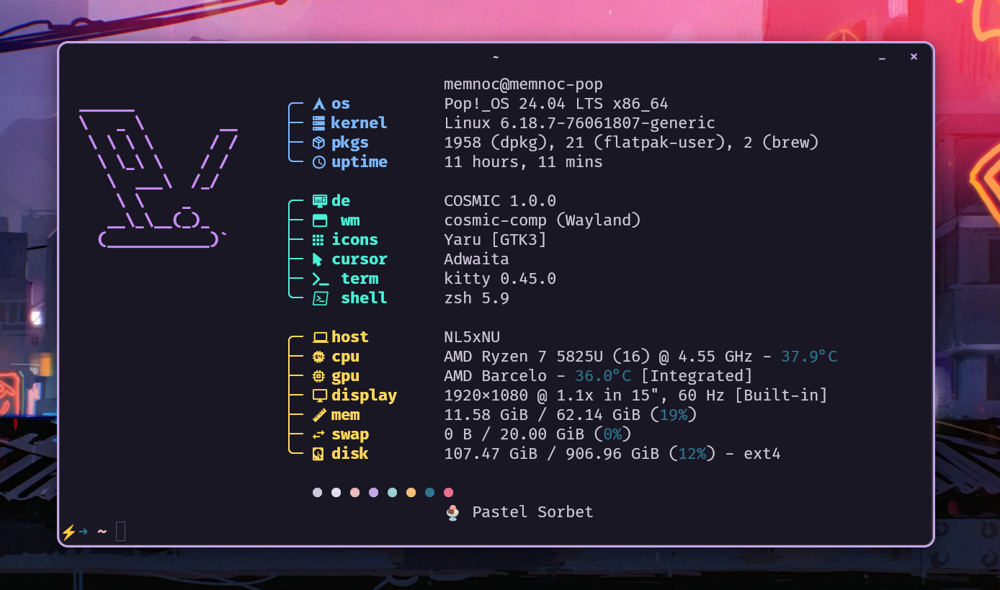

# fastfetch config

Minimal fastfetch configuration with tree-style grouped modules, Nerd Font icons, and color-coded sections.



## Install

```bash
mkdir -p ~/.config/fastfetch
cp config.jsonc ~/.config/fastfetch/config.jsonc
```

## Requirements

- [fastfetch](https://github.com/fastfetch-cli/fastfetch)
- A [Nerd Font](https://www.nerdfonts.com/) set as your terminal font
